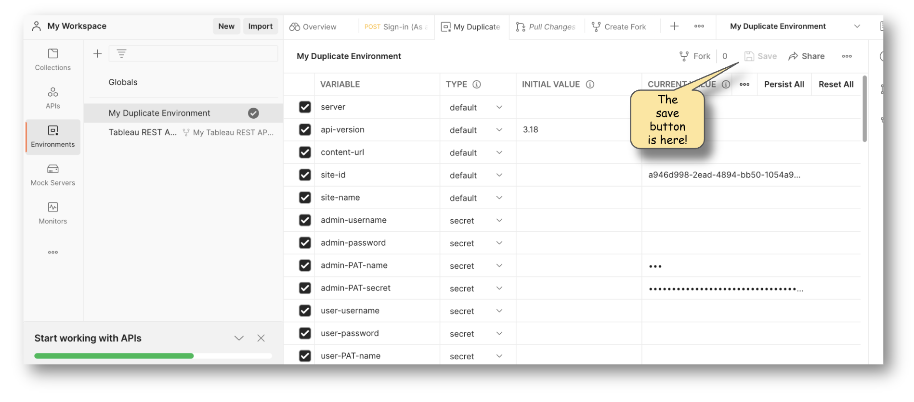
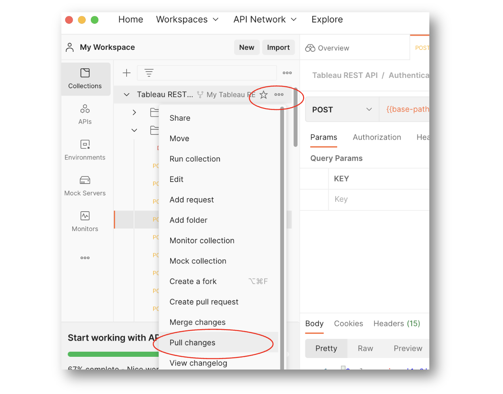
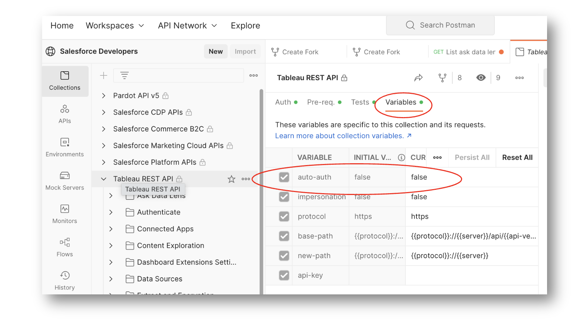

# Tableau REST API Postman Collection

## Overview
This repository contains an open source collection of Postman requests for each method in the [Tableau REST API](https://help.tableau.com/current/api/rest_api/en-us/REST/rest_api.htm) surface. 

- **[How to use the collection](#how-to-use-the-collection)**
- **[How to contribute to the collection](#how-to-contribute)** _(in the Postman app)_
- **[View or add issues](https://github.com/tableau/tableau-postman/issues)** _(in this repo)_

</br>

> **About the repository:** This GitHub repo is only used for [issue tracking](https://github.com/tableau/tableau-postman/issues). Usage of the collection and environment files as well as contributions or enhancements to said files will take place in Postman, not on this repo. See the _[How to Use the Collection](#how-to-use-the-collection)_ and _[How to Contribute](#how-to-contribute)_ sections of this README.

</br>

> **About the Tableau REST API:** The Tableau REST API enables you to perform many of the actions available through the Tableau UI programmatically in scripts, terminals and applications. Resources you might find useful: 
>
>- For detailed descriptions of each method read the [REST API reference](https://help.tableau.com/current/api/rest_api/en-us/REST/rest_api.htm).
>- Join the [Tableau Developer Program](https://developer.tableau.com) (_includes a free Tableau sandbox and an invitation to join the #DataDev workspace on Slack!_).
>- Slack with REST API creators and users on **Tableau #Datadev** **#help-rest-api**.
>- Interact with fellow devs in the [Tableau REST API Community Forum](https://community.tableau.com/s/topic/0TO4T000000QFAxWAO/rest-api).

</br>

> **About this collection:** The preformatted requests in this collection allow you to discover and make calls for each method in the REST API to your Tableau Cloud site or Tableau Server. You can use it to make small administrative changes, prototype the request for your script, see a real example of the response for your request, and more. 
>
>The collection has also been enhanced with scripts and environment variables to make it easier to use.

</br>

## How to use the collection

To get started, follow these three steps:

1. _In Postman:_ [Fork the collection itself](#step-1-fork-the-tableau-rest-api-collection).
2. _In Postman:_ [Fork the environment variables for the collection](#step-2-fork-the-environment-variables-for-the-collection).
3. _In your fork_: [Declare values for variables](#step-3-declare-values-for-variables).

Once you have completed these steps you are ready to send requests to your Tableau environment!

Check out [Advanced Usage](#advanced-usage) for more additional tips and [Who to Thank](#who-to-thank) to find the original authors of this collection.
___
### **Step 1: Fork the Tableau REST API collection**

1. Go to the [Tableau collection in the Salesforce Postman workspace ](https://www.postman.com/salesforce-developers/workspace/salesforce-developers/collection/12721794-67cb9baa-e0da-4986-957e-88d8734647e2) in a browser.
2. Sign in to or create a free Postman account.  
3. Choose the three dots next to **Tableau REST API** to view more actions.

4. Choose **Create a fork**.
5. Name the fork and the Postman workspace you want it to live in.
   
6.  Keep the **Watch original collection** checkbox selected to be alerted whenever updates are available to the collection.
7. Choose **Fork collection**. 
   
   > At this point you should see the collection in your Postman workspace.

### **Step 2: Fork the environment variables for the collection**

1. Go to the [**Environments**  section of the the Salesforce Postman workspace ](https://www.postman.com/salesforce-developers/workspace/salesforce-developers/collection/12721794-67cb9baa-e0da-4986-957e-88d8734647e2) .
1. Choose the three dots next to **Tableau REST API Environment** to view more actions.
3. Choose **Create a fork**.
4. Name the fork. 
1. Make sure to use the same Postman workspace you used for the collection.  
5.  Keep the **Watch original collection** checkbox selected to be alerted whenever updates are available to the collection.
6. Choose **Fork environment**.

   > Now you should see the **Tableau REST API Environment** environment variables in your Postman workspace.

7. Choose the three dots next to the forked environment and rename it to differentiate it from the original.

   > This way, if you want to set up multiple environments for different Tableau servers or sites, you can duplicate the original environment variables and customize credentials and other values per environment.
   

### **Step 3: Declare values for variables**

To configure the collection for your Tableau environment: 

1. Go to the **Environment Variable** section of Postman and open the **Tableau REST API Environment** file.

    > ***NOTE:*** you can duplicate your fork to declare environment variables for different Tableau sites and servers. That way each set of environment variables can be saved for later use. 



1. For the `server` variable value, enter the domain of your Tableau service into the `CURRENT VALUE` field. For instance: 

   ```
   myserver.example.com
   ```
    or 
   
   ```
   10ay.online.tableau.com
   ```

2. Select the authentication method you wish to use and declare the `CURRENT VALUE` for those fields in the environment file. A detailed description of available methods can be found in the [Authentication section of the API Reference](https://help.tableau.com/current/api/rest_api/en-us/REST/rest_api_ref_authentication.htm#sign_in). Authentication methods include Username & Password, [Personal Access Token](https://help.tableau.com/current/online/en-us/security_personal_access_tokens.htm) (PAT), and JWT (Connected Apps).

</br>

>***NOTE:*** Credentials are mapped to individual users which enforce access controls and permissions defined in your Tableau environment. This means that certain methods are only available to admin users and API responses will only contain data that the given user has access to. 
>
>To understand how credentials are kept safe within Postman, refer to the documentation on [initial and current variables](https://learning.postman.com/docs/sending-requests/managing-environments/#adding-environment-variables) as well as [variable types](https://learning.postman.com/docs/sending-requests/variables/#variable-types).
>
>With this in mind it is often preferred by developers to use credentials for an admin user with greater access to API methods while also being able to [impersonate other users](https://help.tableau.com/current/api/rest_api/en-us/REST/rest_api_ref_authentication.htm#sign_in) when needed.
>
>| Credential                  | Variables              |
>| -----------                 | -----------            |
>| Username & Password         | `admin-username`       |
>|                             | `admin-password`       |
>| Personal Access Token (PAT) | `admin-PAT-name`       |
>|                             | `admin-PAT-secret`     |
>| Connected Apps (JWT)        | `JWT`                  |

</br>

1. Modify `content-url`, the permanent name of a Tableau site. The `content-url` in the following examples is "mySite":

   ```
   http://myServer.com/#/site/mySite/

   https://10ay.online.tableau.com/#/site/mySite
   ```

2. Set `api-version` to match the version of the REST API that you wish to use ([see REST API versioning](https://help.tableau.com/current/api/rest_api/en-us/REST/rest_api_concepts_versions.htm#rest_api_versioning)).

3. Save your changes.

4. Authenticate by running a sign in request and BOOM!, you are ready to use the collection.

   See [Auto Authentication](#auto-authentication) to skip manual sign in.

To learn more about using the REST API, try the [Get Started Tutorial](https://help.tableau.com/current/api/rest_api/en-us/REST/rest_api_get_started_tutorial_intro.htm) in the API reference.


## Advanced Usage

- [Update your forks](#update-your-forks)
- [Use Auto Authentication](#use-auto-authentication)
- [Set environment variables from response values](#set-environment-variables-from-response-values)

#### **Update your forks**

  To update your collection forks, select the three dots next to the collection name, and then select **Pull changes**.

  

--------------
#### **Use Auto Authentication** 

  To authenticate yourself in Tableau manually, choose and use one of the authentication methods that matches the credential type that you have configured in your environment variables. You can configure the collection to skip manual authentication and automatically authenticate when you make a request.

  To turn on auto authentication, choose the **Tableau REST API Collection** in Postman at the top level, and then choose the **Variables** tab, and set the current value of `auto-auth` to `true`.

  

  > Note that if authentication fails with one auth type, `auto-auth` will try the next auth type. This can cause unexpected circumstances or errors, for instance, if you have both PAT and username credentials configured in your environment variables, `auto-auth` will use the username when the PAT expires. Or a method may work with PAT credentials but fail if `auto-auth` falls through to JWT credentials that are not scoped for that method.

-----------
#### - **Set environment variables from response values**

Postman allows you to right-click on the returned value in a request's response body and assign that value to an environment value.  This is helpful because a common action is to make a REST request in order to find the ID or name of a resource (workbook, user, datasource., etc.) in order to use that value in the next REST request. 
  
This collection supplies a comprehensive list of variables for each Tableau resource type. Those variables are also formatted in the URI paths for each request. This means that using an ID or name from a response in the next request is quick, easy, and much less bug prone than copy pasting these values.


_______

## How to contribute
This collection is open source and we welcome your contributions! 

### Make pull requests

> Make your pull requests for contributions to the collection **in the Postman environment**, not in this repo!

The steps are very similar to making a pull request in Git:

1. [Create a fork of the collection](https://www.postman.com/salesforce-developers/workspace/salesforce-developers/collection/12721794-7d783742-165f-4d10-8c4c-5719fb60fba2/fork?origin=sidebar) in Postman.

2. Make additions or other changes.

3. Choose **Create a pull request** using the three dots to the right of the collection name.

For detailed info, see [creating a Postman pull request for a fork](https://learning.postman.com/docs/collaborating-in-postman/using-version-control/version-control-overview/).

### Report or explore issues

> Issues are tracked **in this GitHub repo**.

Use the [Issues](https://github.com/tableau/tableau-postman/issues) page of this repo to create or see existing issues with the collection.
## Who to Thank
The Tableau Postman collection is a gift to the Tableau community from three of Tableau's great Solutions Engineers: [Stephen Price](https://github.com/stephenlprice), [Jeremy Mayo](https://github.com/jeremymayo), and [Alex Cortez](https://github.com/joseacortez91). 


 
